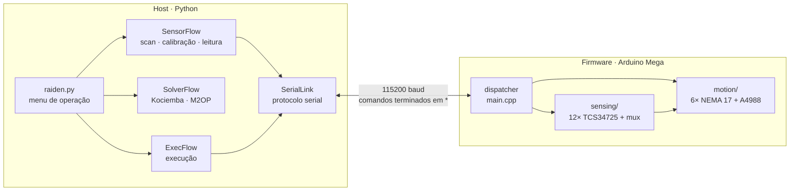

# Raiden — Robô Solucionador de Cubo Mágico

Projeto de extensão da FEEC/UNICAMP que integra ensino, pesquisa e extensão
na construção de um robô que **lê**, **resolve** e **executa** a solução de
um cubo mágico 3×3×3, desenvolvido junto a oficinas com estudantes do ensino
médio da rede pública.

O robô tem seis motores de passo (um por face) e doze sensores de cor
(dois por face). Um Arduino Mega sensoria e movimenta o cubo; um computador
calcula a solução e orquestra o processo pela porta serial.

**Versão atual:** `v1.0`, pipeline completo validado no hardware
(sensoriamento 48/48 nos embaralhamentos de teste, solução e execução).

## Arquitetura



Uma operação completa:

1. **Preparar** (cubo resolvido): verificação dos sensores (`s0*`),
   calibração de cor (`c0*`) e calibração vermelho/laranja (`c1*`).
2. **Resolver**: o firmware lê as 48 casas girando cada face (`r0*`), o host
   calcula a solução e envia a sequência de movimentos (`JAJDGA*`...).

As duas linguagens conversam só por **contratos** versionados em
[`software/contracts/`](software/contracts):

| Contrato | Define |
|---|---|
| [`serial_protocol.md`](software/contracts/serial_protocol.md) | comandos, respostas, erros e tempos da serial |
| [`move_alphabet.md`](software/contracts/move_alphabet.md) | movimento → caractere `A`..`R` |
| [`cube_state.md`](software/contracts/cube_state.md) | estado do cubo: 6 faces × 8 casas |
| [`sensor_map.md`](software/contracts/sensor_map.md) | sensores, fiação e como a cor é decidida |
| [`calibration.md`](software/contracts/calibration.md) | protocolo de calibração e diagnóstico por sintoma |

## Estrutura do repositório

```
software/
├── contracts/          contratos host ↔ firmware
├── firmware/           PlatformIO, um único binário para o Mega
│   └── src/            main.cpp · motion/ · sensing/ · protocol/
├── host/               Python
│   ├── raiden_gui.py   ponto de entrada (interface gráfica)
│   ├── raiden.py       ponto de entrada (menu no terminal)
│   ├── app/            main_raiden (orquestrador) · communication/ · ui_ux/ (interface)
│   ├── sensor/         SensorFlow
│   ├── solver/         SolverFlow · base.py (adapter) · methods/ (kociemba, m2op)
│   ├── execution/      ExecFlow
│   └── tests/          testes do host
└── tools/
    └── firmware_dummy/ firmware simulado para testar o host sem o robô
hardware/   datasheets e eletrônica
structure/  modelos 3D (CAD) da estrutura
classroom/  material das oficinas de extensão
```

## Como rodar

### Firmware (Arduino Mega)

1. Instale o [PlatformIO](https://platformio.org/) no VSCode.
2. Abra a pasta `software/firmware/` como raiz do VSCode (é onde está o
   `platformio.ini`).
3. *Build* e *Upload*. A biblioteca `hideakitai/TCS34725` é baixada sozinha.

Para testar comandos à mão, use um monitor serial a 115200 baud e envie,
por exemplo, `s0*`. Com `SENSE_DEBUG 1` em `detect_color.cpp` cada leitura
de sensor é impressa; **deixe em 0** para rodar com o host.

### Host (Python 3.10+)

```bash
cd software/host
python -m venv .venv
.venv\Scripts\activate          # Windows  (Linux/macOS: source .venv/bin/activate)
pip install -r requirements.txt
python raiden_gui.py            # interface gráfica
python raiden.py                # ou: menu no terminal
```

As duas entradas usam o mesmo sistema; escolha o modo de operação na tela:

| Modo | Precisa de | Para quê |
|---|---|---|
| **1 · Demo** | nada | serial simulada em Python; valida o host inteiro |
| **2 · Uno dummy** | Arduino com [`firmware_dummy.ino`](software/tools/firmware_dummy/firmware_dummy.ino) | testa a serial real sem o robô |
| **3 · Real** | robô com o firmware | operação de verdade (os motores se movem) |

A porta do Arduino é detectada sozinha (na interface, o campo *Porta* pode
ficar vazio). Feche o Serial Monitor antes, porque só um programa pode usar a
porta por vez.

### Operação no modo Real

1. Cubo **resolvido**, branco em cima e verde à frente → **1 · Preparar**.
   Leva alguns minutos e termina com o cubo resolvido.
2. Embaralhe o cubo (à mão, ou enviando uma sequência como `JAJDGA`).
3. **2 · Resolver e executar**: lê o cubo, calcula a solução e executa.

As calibrações ficam na memória do Arduino: refaça o **Preparar** após
resetar a placa. O método (Kociemba, ~20 movimentos, ou M2OP, didático,
~200) e a velocidade dos motores ficam em *Configuração* na interface
(itens 8 e 9 no menu do terminal).

Na interface, cada etapa aparece no *Registro* com ✓ ou ✗, o cubo lido é
desenhado planificado e a solução fica visível antes da execução. Toda
operação roda em segundo plano: a janela não congela durante o
sensoriamento, e os botões ficam travados até a operação terminar.

## Testes

De dentro de `software/host/`:

```bash
python -m tests.test_solver        # adapter + Kociemba + M2OP
python -m tests.test_sensor_flow   # regras do sensoriamento (sem hardware)
python -m tests.test_exec          # regras da execução (sem hardware)
python -m tests.test_comm COM5     # serial real, com o firmware_dummy no Uno
```

A validação do sensoriamento no robô usa embaralhamentos com estado
esperado conhecido, descritos em
[`calibration.md`](software/contracts/calibration.md#validação-com-embaralhamentos-conhecidos).

## Apoio

Projeto de extensão "Oficinas de Computação: Robô que Resolve o Cubo
Mágico", com apoio da Pró-Reitoria de Extensão, Esporte e Cultura
(PROEEC/UNICAMP, edital ExteCult), realizado em parceria com o Colégio
Técnico de Campinas (COTUCA).
